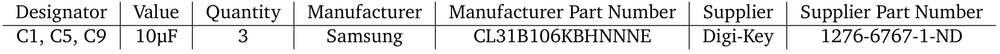
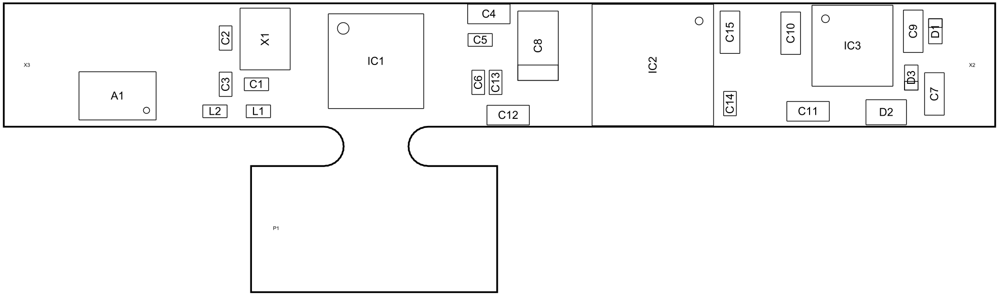

# PCB checklist
This is a checklist for PCB design. I would suggest to read it before starting a new project and a second time before ordering the PCBs. The (Automatic) assembly sections is highly influenced by the pick, place, podcast (https://www.pickplacepodcast.com/).

## Schematic
* Check as many sub-circuits as possible on breadboards
* insert test points between sub-circuits or at interesting / critical locations
    * test points makes it easy to hook on the oscilloscope 
    * for prototypes, THT test points may be easier (e.g. keystone 5001)
    * smd test points are much better for production that SMD test points (eg. TE RCT-0C)
    * just a smd pad can also be a test point, a via in the pad gives additional grip for a probe
    * test points can later be useful for automatic tests
* use signal LEDs (mostly for prototyping stage)
    * voltage X is OK, microcontroller has pass setup routine, ...
    * be careful, efficient LEDs can be very bright
    * do not use LEDs without a resistor in series
* Connect even unused pins to a defined potential (Vcc/GND) unless the data sheet says something else
    * prevent resonant oscillation of unused subparts due to noise
    * sometimes a part is split in subparts, e.g. a dual opAmp. If one is oscillating freely, it can influence the other one
* check pin assignment of connectors double
* check pin assignment of components double
* capacitors close to all ICs? (100nF and 10µF unless the data sheet data sheet says something else)
    * the big one for low frequency noise, the small one for the high frequencies
* check the max voltage rating of all parts
    * don't forget capacitors, sometimes they have large capacitance drop even at nominal voltage
    * also check logic levels between ICs
* avoid crossing lines in the schematic
* check crossing lines for connections 
    * sometimes it's hard to see if two crossing limes are connected
* all components should have a value (100nF, ...)
* avoid using dots or commas in values 3.3V &rarr; 3V3 or 2.2 &rarr; 2R2 or 2.2nF &rarr; 2n2F 
    * sometimes dots are very small and look like dirt 
* check polarizations, especially at electrolytic capacitors
* divide the schematic into logical segments with labels (better readability)
    * boarders between segments are good places for 0 ohm resistors and/or test points
        * a 0 ohm resistor can also be a solder jumper
* check all labels double 
    * spell check
    * doesn't messed Vcc with 3V3 or 3.3V
* open collector connections needs pull ups 
    * internal pull ups are sometimes to high for fast signals or long traces
* split analog and digital power supply
    * at least place appropriate filters
* place ferrite beads or better PI filter into the supply trace next to the ICs (mostly for prototyping stage)
    * ferrite bead: you can start by placing a 0 ohm resistor and easily disconnect the IC by removing it if the IC causes problems, if noise is a problem you can insert the ferrite bead
    * PI filter: you can start by placing a 0 ohm resistor and not fit the capacitors
        * if space is an issue place the capacitors at the bottom ond only place them if really necessary 
* suppress high-frequency components such as switching regulators 
* Have a look at the typical application in the data sheet
    * if your application isn't mentioned, you may have the wrong part for the job
* have a look at schematic checklists or additional resources (application notes, ...) for the IC/package
    * some ICs need additional parts for programming or have antenna design guides and so on
* if you have a programmable chip in your design, don't forget a programming header
* not forget reverse polarity protection (especially for prototyping)
    * use not twistable connectors 
    * use a diode or a diode bridge
* do you need over voltage or ESD protection?
* put a fuse in the main power line
    * smd solder in, if you are sure not to need them
    * easy changeable if you plan to blow them
* buffer your voltage right when it enters the board
* consider maximum power loss of all components
    * transistors, voltage regulators, resistors, ...
* check the max gate voltage of your FETs / max base current of your BJTs
* digital busses at ICs sometimes need external components to determine the bus (I2C or SPI) or the address
* do not use obsolete parts
* use components with tight tolerances for analog circuits
    * voltage divider for output value of a voltage regulator, filters, ...
* ADCs need a anti aliasing filter close to the input
* check if different voltage level have different labels
    * better use values instead of general names Vcc &rarr; 3V3
    * use clear names 3V3_1 &rarr; 3V3_analog
* use a potentiometer if the precise value is not known yet (mostly for prototyping stage)
* check if the part numbers are correct 
    * if want to build only a view check if the order number belongs to single quantity parts instead of reels
* check if all parts are available and in stock
* check the Errata section of the data sheets
* keep the number of different bill of material items small 
    * two 1k resistors makes one 2k resistor 
    * two 1µF capacitors makes one 2µF capacitor and have even lower ESR
    * ...
* use common designator and use them consistent
    * https://en.wikipedia.org/wiki/Reference_designator
* some ICs needs specific power supply sequencing e.g. FPGAs
    * https://www.analog.com/en/analog-dialogue/articles/care-and-feeding-of-fpga-power-supplies-a-how-and-why-guide-to-success.html

## Layout
* import all design rules from your PCB manufacturer
    * Drill/Hole Size
    * Minimum Annular Ring
    * Minimum clearance
    * Minimum trace width and spacing
    * Solder Mask
    * ...
* run the DRC before generating the fabrication data
* use easy values for board dimensions 100mm instead of 98.95231651313513mm
* place connectors first and at place where you can reach them easily 
* place mounting holes 
* place all components at a corse grid (1mm / 1.27mm), especially connectors and mounting holes
    * makes mechanical design easier 
    * makes drawings easier to read
* check your hole diameters 
    * square pins needs a hole with a diameter bigger than the diagonal of pin not the width of the pin (Pythagorean theorem) https://www.worthingtonassembly.com/determining-platedthruhole-sizes
    * some pins are intensional bended and need bigger holes
* do you want solder mask above your vias?
    * free vias can cause problems during soldering
    * free vias can be used as emergency test points 
* do not put silkscreen on pads 
* pin one or polarity marker should be visible even after soldering all parts
    * do not hide them with other parts or the part itself
* if you have many polarized parts next to each other place them in the same direction or in a repeatable pattern
    * ease up visual inspection by humans
* leave a border of min 3mm to the edge of the board where no components are placed
    * handling the board by machines needs room to grab the board
        * not important for small boards since they will be in an panel anyway
    * clamping the board for hand soldering or measurements needs room to grab the board
* do not forget to use ground planes and do not forget to turn them on before generating the fabrication files
* locate test pads in a way that they are easy to probe
* place GND test pads next to critical test pads to avoid large ground loops
* avoid traces next to the board outline so that they don't get damaged during assembly or separating the boards
* do not use tiny parts if not needed!
    * the stencil thickness is determined by the smallest part 
    * small parts are hard to solder by hand (smaller 0402)
    * smaller pitch causes more likely problems during paste printing, reflow and inspection
    * print the footprints of your parts scale 1:1 to get a feeling
* print the final layout scale 1:1 and place all components to check if the footprints are right and parts do not overlap
* separate analog and digital domains at your board
* avoid traces below parts &rarr; cross talk
* traces with high voltages should have enough space to other traces also between layers
* also low frequency busses can have high frequency signals
    * digital signal are square waves and consists of the main frequency and a lot of overtones
* if two pins from the same component have to be connected, do not short them directly, instead use a U shape trace to avoid solder and inspection issues
* check if vias are big enough to handle the current or to provide a small impedance
* double check keep out areas (antennas, connectors, ...)
* keep switching regulators far away from analog parts
* all tracks between switching elements and coils (capacitor) are very short and wide, read the data sheet!
    * also the GND connections!
* label connectors and test point, even at the bottom layer is better than no labels (silkscreen)
* place capacitors and filters close to the respective components
* leave a bit room for rework next to critical parts
* check if all ICs are connected to power and ground (if needed)
* do not forget to place test pads or better hooks for GND
* next to critical traces are no traces with noise
    * do not forget to check other layers
* do not place vias in pads
    * otherwise the solder gets sucked into the via and weakens the joined. It works nice for a while until the joined fails due to mechanical loads
    * if you have to, plug them (expensive)
    * if the via is very close and not tented, it can also suck the solder from the pad. More than 6mil and it should be safe
* check the final layout for traces that are lead to nowhere
* all trace are wide and have a low impedance
    * just because your manufacture can process 3mil traces does not mean it is clever to use them everywhere
* check the current return paths
* check if the ground plane is wide and has no gabs 
    * if you have no dedicated ground plane connect the plane on different layers with vias to bridge gaps
* put information's on your board
    * date, version, name, logo, ...
* think about the text orientation
    * keep it consistent
    * mirror the text at the bottom layer?
* Place tracks far away from each other to avoid cross talk, except for differential pairs
    * even if close traces looks nicer
* tracks with high currents needs big vias or several
* increase the pads far enough to reach them with a soldering tip (mostly for prototyping stage)
    * QFN parts, ...
* if possible use THT or hybrid connectors if the user have to use them often 
    * pads from smd components can rip of 
    * use SMD connectors everywhere else, cheaper and more reliable solder joints
* if you have large pads and you want to use a stencil put bridges into the past layer to split the pad in smaller sections
    * otherwise the paste scraper can sunk into the big pad and remove paste
* check your paste layer if paste is only where you want to want paste (test pads, fiducials, ...)
* use thermal relief to connect your pads to the ground layer
* if possible keep tracks bigger than 5mil 
    * the manufacturer can use half oz copper sheets. Some also use them for 4mil tracks but 5mil is saver
* do not put copper right to the board edge
    * the router to cut out the PCBs dulls much quicker if it has to cut through copper
* be aware of chinese new year
* to prevent tombstone defect, do not place the pads to far away from each other (0402 or smaller)
    * https://www.worthingtonassembly.com/perfect-0201-footprint
    * https://www.worthingtonassembly.com/perfect-0402-footprint
* be nice and put the file format as a comment in your auto generated NC drill files e.g.
    * ;FILE_FORMAT=4:4 Millimeter
    * ;FILE_FORMAT=2:5 Inches
* be even nicer and use Gerber X2    

## Panels
* when creating a panel keep track of the mechanical stiffness for handling the panels
* keep at least 3mm space (components, tracks) to the edge to handle the panels 
* V grooves leaves ruff undefined edges but they are easy to separate
* slots and bridges leave nice well defined edges but needs more space
* if you use slots and bridges, drill holes in the bridges for easier separation
    * recess the holes in a sub circle into the PCB to get a clean edge 
        * good: https://www.worthingtonassembly.com/blog/2018/6/20/recessing-your-pcb-edge-for-perforated-tabs
        https://www.setgmbh.de/en/product/panel-construction
        * not so good https://www.altium.com/documentation/sites/default/files/wiki_attachments/294376/Panel3.png
    * you can route test or programming signals to the panel 
* if you are creating the panel, ask your manufacturer (pcb and assembly) for individual guidelines
* often mounting holes can be very handy
* general tips https://www.worthingtonassembly.com/panelization
* if tracks are to close to the board edge, they can be damaged during depanelization 

## Assembly
* create a part list (BOM)
    * most PCB programmes can do that for you but some better than others
* use green silkscreen 
    * better for inspection
    * most PCB manufacturer have the best performance with green solder mask
* when you order parts you can often upload a *.txt or *.csv file to speed up the process
    * often it is also possible to choose a specific part number for every component. If you upload your list and choose the designator as customer specific part number, you get the right designator printed at every component
* cheap plastic connectors can melt during reflow 

### Assembly by hand
Before assembling the board, the following things should be considered or done:
* order more parts than needed 
    * the smaller and cheaper the more (resistors, capacitors)
* print the part list (BOM), yes on paper
    * most PCB programmes can do that for you but some better than others

* the list should also contain components like connectors, cables, heat sinks, screws, ...
* check if all components are arrived 
* create a assembly diagram and print it, yes also on paper
    * most PCB programmes can do that for you but some better than others

* start with the small parts
    * if you have a very dense board, it could be better to work inside out
* do not place the 0 ohm resistors which are connecting the sections

### Automatic assembly
* talk to the assembly vendor 
    * also in a early design stage
* order more parts than needed 
    * if the boards get assembled automatically and you provide the parts ask pick and place facility
* tall components can hide small components next by
    * can be a problem for the automatic optical inspection
* tolerances can build up if you manufacturing hundreds or thousands of boards, so do not go too close to the limits
* if you can, send them pictures of a assembled board
* put fiducials on your board
    * at least two better three at different corners of your board
    * a copper point with 1mm diameter and an solder mask opening of 3mm is common
    * https://www.worthingtonassembly.com/blog/2014/12/29/what-are-fiducials-and-why-are-they-useful
* you have to provide a part list, assembly drawings, gerber files and a pick and place file
    * the pick and place file have to contain minimum the designators, x and y positions, rotations and the layer
* do not place smd parts next to THT solder joints, at least 2mm better 5mm
    * otherwise selective soldering is only possible with glued smd parts
* to avoid solder bridges while selective or wave solder the protruding leads should be short
* if connectors protrude pass the board edge, mark them on the silkscreen also above the board edge
* antistatic does not me something is ESD protected
* just because you can produce 10-50 boards doesn't mean you can 1000
* Be careful some tolerances are given asymmetrically, e.g. 1mm +0.1 -0
* if you send stuff to someone put notes in/on the package
    * who is the sender, whats inside, whats the purpose (repair, return, parts, ...)
* if you send stuff to someone write them a mail with the tracking information
* high density boards may need cleaning, even if No-Clean flux was used
    * flux residues and other contaminants can cause electrochemical migration
* do not use THT test points unless you have a good reason
    * Harwin - S2761-46R, Keystone - 5019, KOA Speer - RCUCTE 
    * https://www.pickplacepodcast.com/episodes/ep27-when-to-use-through-hole-vs-surface-mount-components
* if a part is available in different packages and it is possible, make the layout in a way that could place either.
    * if the part is only available in one of the packages, you can still produce the board

## Turn it on
* after assembly, check all components
    * orientation, all pins are soldered, all parts are placed
* measure the input impedance
    * GND from the meter to GND of the board (protection diodes)
    * very low impedance &rarr; chances are high that there is a short
* limit the current of the power supply before you turn it on the first time
* turn on the power supply before plugging in the cables
    * some inexpensive power supplies deliver a higher voltage for a very short time when switched on, which could destroy components.
* since you did not have soldered the 0 ohm resistors yet, you can power up the board section by section
    * start with the voltage regulators